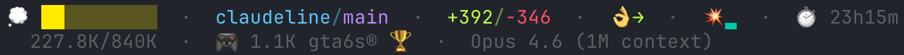

<div align="center">

<h1>claudeline</h1>

**A cute, informative status line for Claude Code with rotating environmental metrics.**

[](LICENSE)
[](https://www.gnu.org/software/bash/)
[](https://claude.ai/)

</div>

```
✨ ████░░░░░░  ·  myrepo/main*  ·  +50/-20  ·  👌→  ·  💥▃  ·  💳25%  ·  ⏱️ 45m
│  └────┬────┘     └─────┬─────┘   └───┬──┘   └─┬──┘  └─┬┘   └─┬──┘    └──┬───┘
│    context          repo/branch     lines    pace  burst  credit    duration
│    bar              + git status    changed  trend
└─ context icon (✨🌱💭🧠⚡🔥🌡️🫠💀💾)

    73.5K/168K  ·  🍕 3 joe's®  ·  Opus 4.6
    └────┬────┘    └─────┬─────┘   └───┬───┘
      context         rotating       model
      tokens          metric
```

<div align="center">

</div>

<hr>

<h2 align="center">📑 Contents</h2>

- [🚀 Quick Start](#quick-start)
- [✨ Features](#features)
- [📊 Smart Pace Indicator](#smart-pace-indicator)
- [💥 Burst & Credit Indicators](#burst--credit-indicators)
- [🌍 Environmental Impact](#environmental-impact)
- [🏆 All-Time Tracking](#all-time-tracking)
- [⚡ Performance](#performance)
- [🔒 Privacy & Network Access](#privacy--network-access)
- [🔧 Requirements](#requirements)
- [🗑 Uninstall](#uninstall)

<hr>

<h2 align="center" id="quick-start">🚀 Quick Start</h2>

**One command:**

```bash
curl -fsSL https://raw.githubusercontent.com/s-b-e-n-s-o-n/claudeline/main/install.sh | bash
```

Then restart Claude Code. That's it.

<details>
<summary>Manual installation</summary>

1. Download the runtime files:
   ```bash
   mkdir -p ~/.claude/lib
   curl -fsSL https://raw.githubusercontent.com/s-b-e-n-s-o-n/claudeline/main/statusline.sh -o ~/.claude/statusline.sh
   curl -fsSL https://raw.githubusercontent.com/s-b-e-n-s-o-n/claudeline/main/lib/statusline_display.sh -o ~/.claude/lib/statusline_display.sh
   curl -fsSL https://raw.githubusercontent.com/s-b-e-n-s-o-n/claudeline/main/lib/statusline_usage.sh -o ~/.claude/lib/statusline_usage.sh
   curl -fsSL https://raw.githubusercontent.com/s-b-e-n-s-o-n/claudeline/main/lib/jsonl_parser.pl -o ~/.claude/lib/jsonl_parser.pl
   chmod +x ~/.claude/statusline.sh
   ```

2. Add to your `~/.claude/settings.json`:
   ```json
   {
     "statusLine": {
       "type": "command",
       "command": "~/.claude/statusline.sh",
       "padding": 0
     }
   }
   ```

3. Restart Claude Code

</details>

<hr>

<h2 align="center" id="features">✨ Features</h2>

<table>
<tr>
<td align="center" width="33%">
<h3>10-Tier Context Bar</h3>
Adapts to auto-compact setting — scales to 168K (ON) or 200K (OFF) with color gradient and emoji icons
</td>
<td align="center" width="33%">
<h3>Smart Pace Indicator</h3>
Dual-signal weekly pace (burn rate + pressure) with 8-tier emoji scale and velocity-based trend arrows
</td>
<td align="center" width="33%">
<h3>Burst & Credit</h3>
8-level colored bar for 5-hour rate limit with reset countdown, plus overage credit tracking
</td>
</tr>
<tr>
<td align="center">
<h3>Environmental Metrics</h3>
Rotating display of water, power, and data usage with dynamic unit scaling (drops → gallons, Wh → MWh)
</td>
<td align="center">
<h3>Fun Cost Conversions</h3>
34 normal + 7 absurd items with multi-unit scaling — see your session cost in joe's pizza slices or joey-chestnuts
</td>
<td align="center">
<h3>All-Time Tracking</h3>
Cumulative usage across all sessions from JSONL files, shown with 🏆 trophy on rotating cycle
</td>
</tr>
<tr>
<td align="center" width="33%">
<h3>Git Integration</h3>
Repo/branch with status indicators — unstaged, staged, ahead/behind, stash count
</td>
<td align="center" width="33%">
<h3>24-Bit True Color</h3>
Vibey 2025 palette with distinct colors for every tier and indicator
</td>
<td align="center" width="33%">
<h3>1M Context Support</h3>
Detects extended context windows and scales the bar accordingly
</td>
</tr>
</table>

<hr>

<h2 align="center" id="smart-pace-indicator">📊 Smart Pace Indicator</h2>

Compares your actual weekly usage against where you *should* be based on time elapsed in the 7-day rolling window.

**The math:** Two signals, take the worse one:
- **Burn rate** (velocity): `(pct / days_elapsed) × 7 / 100` — how fast you're going
- **Pressure** (position): `days_remaining / budget_remaining_in_days` — remaining runway

`effective = max(burn_rate, pressure)`

Both signals agree on over/under pace (`> 1.0` = over, `< 1.0` = under), but pressure amplifies urgency when budget is thin. For example, at 91% on Monday 8pm with reset Thursday 1pm: burn rate is 1.48 (🥵) but pressure is 4.29 — you have 9% left for 2.7 days (🚨).

Combined display: `👌→` (on pace, stable) or `🔥↑` (hot, getting hotter). At 100%, shows reset countdown: `🚨 -1.2d`. Alternates with raw % every 10th update.

<details>
<summary><strong>Pace emoji tiers</strong></summary>

| Effective Rate | Emoji | State |
|-------|-------|-------|
| < 0.3 | ❄️ | Way under pace |
| 0.3-0.6 | 🧊 | Under pace |
| 0.6-0.85 | 🙂 | Comfortable |
| 0.85-1.15 | 👌 | On pace |
| 1.15-1.4 | ♨️ | Warming |
| 1.4-1.8 | 🥵 | Hot |
| 1.8-2.5 | 🔥 | Very hot |
| ≥ 2.5 | 🚨 | Critical |

</details>

<details>
<summary><strong>Trend arrows</strong></summary>

Tracks **usage% velocity** — how fast you're burning tokens compared to the sustainable rate (100% / 7 days ≈ 0.01%/min).

| Velocity | Arrow | Meaning |
|----------|-------|---------|
| > 3x sustainable | ↑ | Heating fast |
| 1.5-3x sustainable | ↗ | Warming up |
| 0.5-1.5x sustainable | → | Stable |
| 0.1-0.5x sustainable | ↘ | Cooling down |
| < 0.1x sustainable | ↓ | Cooling fast |

**History retention:** Last 15 min dense (every ~30s), 15min–24h sparse anchors (1 per 4h), older pruned.

</details>

<hr>

<h2 align="center" id="burst--credit-indicators">💥 Burst & Credit Indicators</h2>

**💥 Burst** (5-hour rate limit) — colored bar mapped directly to API utilization %, only shown when > 0%.

| Range | Bar | Color |
|-------|-----|-------|
| 1-12% | ▁ | cyan |
| 13-24% | ▂ | teal |
| 25-37% | ▃ | green |
| 38-49% | ▄ | yellow |
| 50-62% | ▅ | orange |
| 63-74% | ▆ | red |
| 75-87% | ▇ -135m | magenta + countdown |
| 88%+ | █ -90m | bright magenta + countdown |

At 75%+, a dimmed countdown shows minutes until the 5-hour window resets.

**💳 Credit** (overage balance) — only shown when weekly or burst usage hits 100% with active credit spend.

<hr>

<h2 align="center" id="environmental-impact">🌍 Environmental Impact</h2>

The rotating metrics visualize the environmental cost of AI inference:

| Metric | Rate | Source |
|--------|------|--------|
| 💧 Water | 1 gal = 760k tokens | [arxiv:2304.03271](https://arxiv.org/pdf/2304.03271) |
| ⚡ Power | 1 kWh = 240k tokens | [arxiv:2505.09598](https://arxiv.org/html/2505.09598v1) |
| 💰 Cost | Built-in | Claude Code API |

**Dynamic units:** Water scales drops → tsp → tbsp → oz → cups → pints → quarts → gallons. Power scales Wh → kWh → MWh.

<details>
<summary><strong>Fun cost conversions (34 normal + 7 absurd)</strong></summary>

Many items have **multi-unit scaling** — they pick the appropriate unit based on cost:
- Joe's: bite ($0.33) → joe's ($4)
- Nathan's: bite ($1) → dog ($6) → joey-chestnut ($456)
- Starbucks: sip ($0.31) → starbucks ($5.50)
- Yuengling: sip ($0.37) → yuengling ($7) → keg ($200)

**Normal Items (34)** — shown in session + all-time normal:

| Emoji | Item | Price |
|-------|------|-------|
| ☕ | starbucks® | $5.50 |
| 🍕 | joe's® | $4 |
| 🌮 | tacorias® | $4.60 |
| 🍺 | yuenglings® | $7 |
| 🍔 | shackburgers® | $9 |
| 🍌 | chiquitas® | $0.30 |
| 🍿 | alamos® | $18 |
| 🎮 | gta6s® | $70 |
| 🧻 | charmins® | $1 |
| 🖍️ | crayolas® | $0.11 |
| 🥑 | haas® | $2 |
| 🥨 | auntie-annes® | $5 |
| 🦪 | blue-points® | $3.50 |
| 🌭 | nathans® | $6 |
| 🥯 | ess-a-bagels® | $4 |
| 🍣 | nami-noris® | $8 |
| 🥩 | lugers® | $65 |
| 🛢️ | exxon-valdezs® | $75 |
| 🥤 | big-gulps® | $2.50 |
| 🍝 | carbones® | $40 |
| 🦞 | redlobsters® | $30 |
| 🥗 | sweetgreens® | $15 |
| 🏋️ | equinoxs® | $260 |
| 🚴 | soulcycles® | $38 |
| 🍪 | levains® | $5 |
| 🌯 | chipotles® | $12 |
| 🧃 | juice-presses® | $11 |
| 🍟 | pommes-frites® | $9 |
| 🛴 | razors® | $35 |
| 🚋 | njts® | $5.90 |
| 🖱️ | magic-mice® | $99 |
| 📱 | iphones® | $999 |
| 🥐 | cronuts® | $7.75 |
| 🎵 | apple-musics® | $0.004 |

**Absurd Items (7)** — all-time only, decimal chasing 1:

| Emoji | Item | Price |
|-------|------|-------|
| 🚐 | sprinters® | $50,000 |
| 🧟 | thrillers® | $1,600,000 |
| 🏝️ | private-islands® | $18,000,000 |
| 🏪 | chipotle-franchises® | $1,000,000 |
| 🚁 | h130s® | $3,500,000 |
| ☕ | starbucks-franchises® | $315,000 |
| ☕ | starbucks-ceo-pays® | $57,000,000 |

</details>

<details>
<summary><strong>Fun power conversions (8 items)</strong></summary>

| Emoji | Item | Rate | Example |
|-------|------|------|---------|
| 🔌 | phone-charging | 5W | `🔌 833h phone-charging` |
| 💡 | hue-light® | 10W | `💡 417h hue-light®` |
| 🏠 | home-power | 1kW | `🏠 4.2h home-power` |
| 🏢 | 395-hudson® | 2MW | `🏢 7.5s 395-hudson®` |
| 🚗 | 4xe® | 1.45 mi/kWh | `🚗 6.0mi 4xe®` |
| ✈️ | a320neo® | 0.019 mi/kWh | `✈️ 421ft a320neo®` |
| 🪨 | coal | ~1 lb/kWh | `🪨 4.2 lbs coal` |
| ☢️ | reactor-output | 1GW | `☢️ 15ms reactor-output` |

Session displays phone through a320neo. Coal and reactor are all-time only.

</details>

<hr>

<h2 align="center" id="all-time-tracking">🏆 All-Time Tracking</h2>

Cumulative usage across all sessions by scanning JSONL files in `~/.claude/projects/`.

The 🏆 trophy indicates all-time totals. The 8-cycle rotation (10s each) shows:
- **Cycles 0-2, 4-6:** Session metrics (no trophy)
- **Cycle 3:** All-time normal with 🏆 — 15-item rotation: 10 fun cost + coal + reactor + tokens + cost + data
- **Cycle 7:** All-time absurd with 🏆 (e.g., `🏝️ 0.0015 private-islands® 🏆`)

<details>
<summary><strong>Context bar tiers</strong></summary>

**Auto-compact ON** (10 tiers, scaled to 168K):

| Range | Color | Icon | Meaning |
|-------|-------|------|---------|
| 0-9% | Cyan | ✨ | Fresh |
| 10-19% | Lime | 🌱 | Growing |
| 20-34% | Yellow | 💭 | Thinking |
| 35-49% | Orange | 🧠 | Working hard |
| 50-61% | Coral | ⚡ | Heating up |
| 62-73% | Red | 🔥 | Hot |
| 74-83% | Hot Pink | 🌡️ | Running hot |
| 84-91% | Magenta | 🫠 | Melting — compact soon |
| 92-96% | Violet | 💀 | Critical |
| 97%+ | White Hot | 💾 | About to auto-compact |

**Auto-compact OFF** (8 tiers, scaled to 200K):

| Range | Color | Icon | Meaning |
|-------|-------|------|---------|
| 0-14% | Cyan | ✨ | Fresh |
| 15-29% | Lime | 🌱 | Growing |
| 30-49% | Yellow | 💭 | Thinking |
| 50-64% | Orange | 🧠 | Working hard |
| 65-74% | Coral | 🔥 | Hot |
| 75-84% | Red | 💾 | Compact zone |
| 85-94% | Hot Pink | 🫠 | Past compact zone |
| 95%+ | Magenta | 💀 | Near hard wall |

</details>

<hr>

<h2 align="center" id="performance">⚡ Performance</h2>

| Scenario | Time |
|----------|------|
| Fully warm (typical) | ~180ms |
| Warm state, expired cache | ~195ms |
| Best case | ~175ms |
| Cold JSONL scan (first run) | ~6s (10K+ files, 1.2GB) |

**Cost breakdown** (warm, ~180ms total):

| Phase | Time | Tool |
|-------|------|------|
| Git status | ~90ms | 3 git calls |
| jq parse | ~16ms | 1 jq call |
| Trend/pace | ~20ms | 1 awk call |
| JSONL cache read | ~5ms | bash read |
| Formatting | ~22ms | 1 awk + bash math |
| Source libs + rest | ~27ms | bash |

Rate limit data comes directly from the Claude Code status line JSON — zero network calls during normal operation. Cold JSONL scans use a fast streaming pipeline (`xargs cat | perl`) for immediate results, then build per-file state lazily so subsequent scans only process appended bytes.

<hr>

<h2 align="center" id="privacy--network-access">🔒 Privacy & Network Access</h2>

claudeline makes **one optional API call** to `https://api.anthropic.com/api/oauth/usage` — a `GET` request with only an `Authorization` header. No telemetry, no tracking, no data sent in the request body. This call only triggers when weekly or burst rate limits reach 100%, to fetch overage/credit utilization.

The OAuth token is read from:
- **macOS:** macOS Keychain via `security find-generic-password`
- **Linux:** `~/.config/claude/credentials.json`

The API call runs in a **non-blocking background subshell** so it never stalls the status line.

| Variable | Effect |
|----------|--------|
| `CLAUDELINE_NO_NETWORK=1` | Disables all network access — the API call is skipped entirely |
| `CLAUDELINE_DEBUG=1` | Enables debug logging to `$TMPDIR/claudeline-statusline-debug.log` |

**Local data stored** in `~/.claude-usage.d/` (created with `chmod 700`):

| File | Purpose |
|------|---------|
| `.jsonl-cache` | Cached all-time token/cost totals (5-min TTL) |
| `.jsonl-state` | Per-file JSONL scan state for incremental updates |
| `.usage-history` | Rolling 24h usage samples for trend arrows |
| `.extra-usage-cache` | Cached overage/credit data |
| `.claude-config-cache` | Cached auto-compact setting |

<hr>

<h2 align="center" id="requirements">🔧 Requirements</h2>

<div align="center">

[](https://jqlang.github.io/jq/)
[](https://git-scm.com/)
[](https://www.perl.org/)

</div>

<hr>

<h2 align="center" id="uninstall">🗑 Uninstall</h2>

```bash
# Remove statusline files
rm -f ~/.claude/statusline.sh
rm -rf ~/.claude/lib/statusline_display.sh ~/.claude/lib/statusline_usage.sh ~/.claude/lib/jsonl_parser.pl ~/.claude/lib/anthropic_pricing.json

# Remove the statusLine key from settings.json
jq 'del(.statusLine)' ~/.claude/settings.json > ~/.claude/settings.json.tmp && mv ~/.claude/settings.json.tmp ~/.claude/settings.json

# Remove cached data (optional)
rm -rf ~/.claude-usage.d
```

Then restart Claude Code.

---

<div align="center">

**[MIT License](LICENSE)**

</div>
